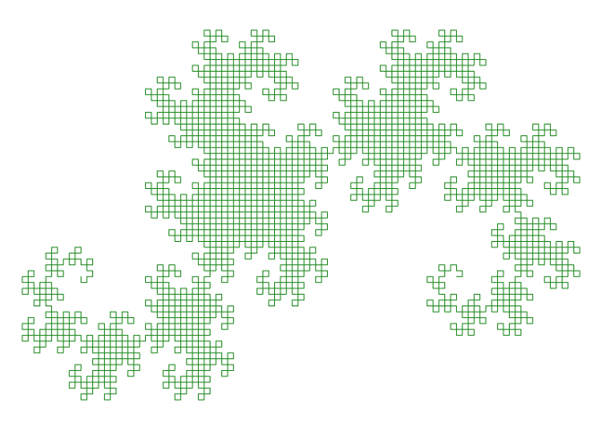
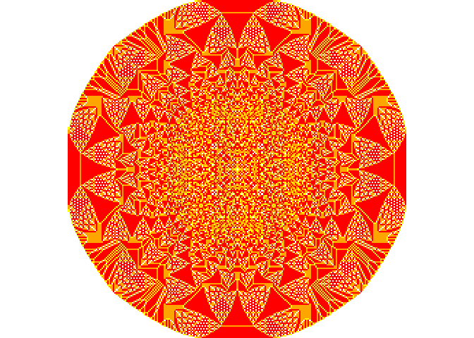

<!-- README.md is generated from README.Rmd. Please edit that file -->

# fractalplotr

<!-- badges: start -->

<!-- badges: end -->

The goal of fractalplotr is to … (FIXME)

## Installation

You can install fractalplotr from GitHub with:

``` r
install.packages("devtools")
devtools::install_github("bastihz/fractalplotr")
```

## Examples

TODO: better image resolution, maybe a little smaller images? See how it
looks on the phone and the laptop.

**Dragon curves** (TODO: link to wikipedia)

``` r
d <- dragon_curve(12)
plot(d)
```



**Mandelbrot sets** (TODO: link to wikipedia)

``` r
m <- mandelbrot(width = 500, height = 400)
plot(m)
```


**Sandpiles** (TODO: link to wikipedia)

``` r
s <- sandpile(10000)
plot(s)
```


